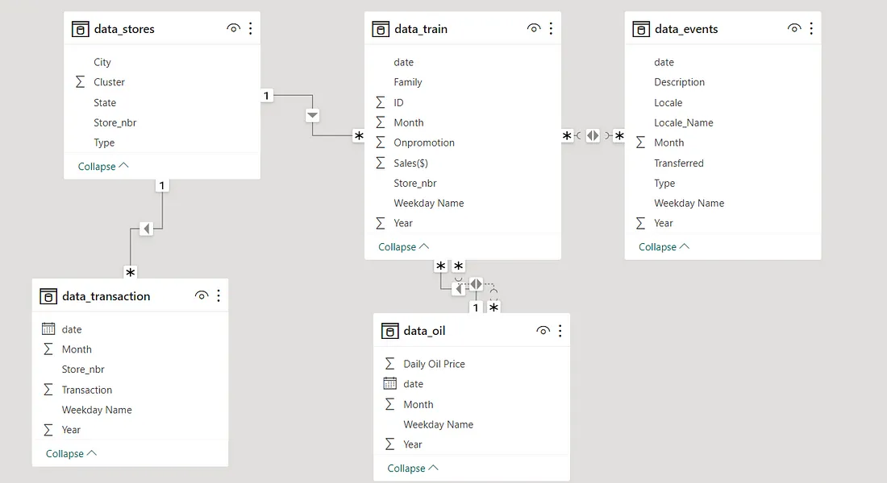
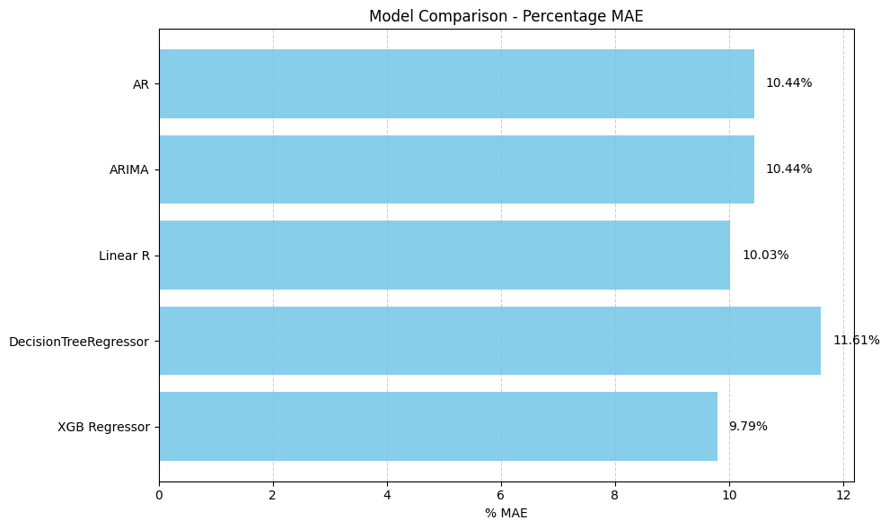
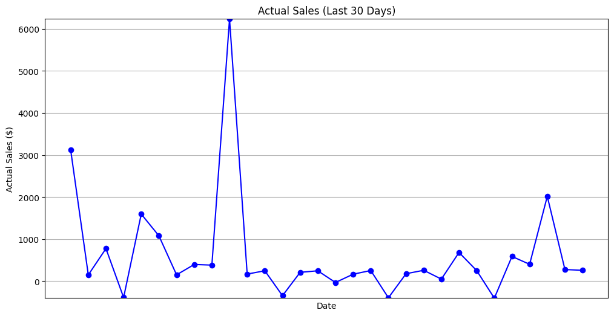
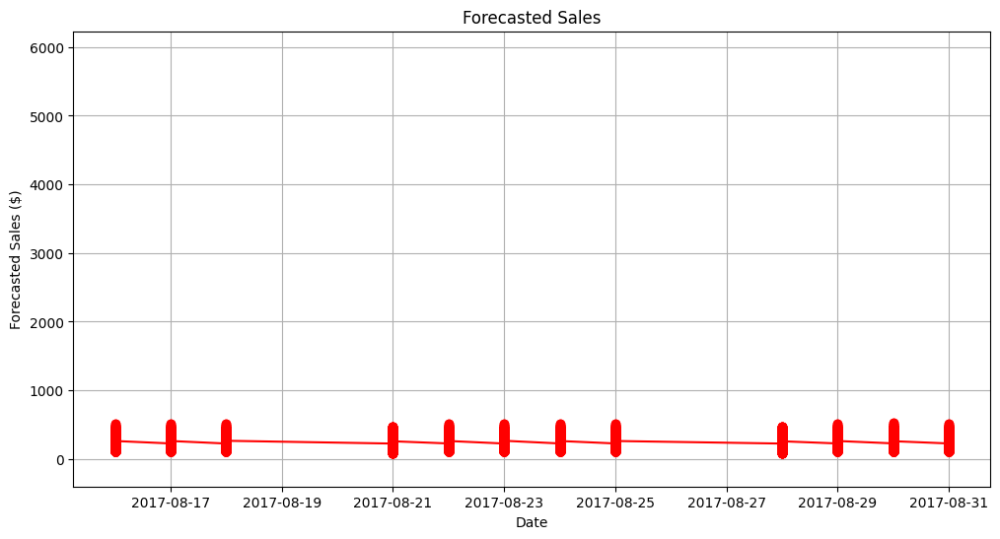

## ENHANCING STORE SALES PREDICTION FOR FAVORITA. 

  

## Project Summary
**Unlocking the Power of Data**: Welcome to our journey of data-driven transformation in the retail realm, where we endeavored to revolutionize sales forecasting for Favorita Corporation. Our mission? To empower Favorita with the foresight to thrive in an ever-evolving market.

**Guided by CRISP-DM**: We embarked on this odyssey with the Cross-Industry Standard Process for Data Mining (CRISP-DM) as our compass. It led us through the intricate terrain of understanding, preparing, modeling, and evaluating to uncover valuable insights.

# Table of Contents
- [Business Understanding](#Business-understanding)
- [Data Preparation](#Data-preparation)
- [Data Understanding](#Data-understanding)
- [Modelling](#modelling)
- [Evaluation](#evaluation)
- [Conclusion and Insights](#Conclusion-and-Insights)

## Business Understanding 
In our quest for retail enlightenment, we posed questions that unveiled the essence of Favorita's business landscape. From data completeness to the seismic impact of earthquakes, we explored the intricate dance between promotions, oil prices, holidays, and sales.

The required business questions formulated to assist with analysis:

1. Is the train dataset complete (has all the required dates)?

2. Which dates have the lowest and highest sales for each year?

3. Did the earthquake impact sales?

3. Are certain groups of stores selling more products? (Cluster, city, state, type)

4. Are sales affected by promotions, oil prices, and holidays?

5. What analysis can we get from the date and its extractable features?

6. What is the difference between RMSLE, RMSE, and MSE (or why is the MAE greater than all of them)?

## Data Preparation 
Our data voyage encompassed six unique datasets, each a piece of the retail puzzle. With precision, we wove together transactions, store metadata, holiday celebrations, daily oil prices, and more, revealing hidden connections among them.
- Train: The training data, comprising time series of features store_nbr, family, and on promotion, as well as the target sales.
- Test: Has the same features as train data except for the sales column.
Transactions: Contains date, store_nbr, and transactions made on that specific date.
- Stores: Store metadata, including city, state, type, and cluster.
holidays and events: Holidays and Events, with metadata.
-oil: Daily oil price, which includes values during both the train and test data timeframes. (Ecuador is an oil-dependent country and its economic health is highly vulnerable to shocks in oil prices.)

## Data Understanding 
To create a seamless data tapestry, we meticulously prepared every thread. Inconsistencies, missing values, and outliers were tamed. We wielded feature engineering to extract insights and introduced the concept of 'family' categorization for encoding. Our data was now primed and ready.

## Modelling 
In the modeling stage, we crafted five unique forecasting models: AR, ARIMA, Linear Regression, XGB Regressor, and Decision Tree Regressor. After shaping these models, we refined our process by taking the following steps:

Outlier Pruning: First, we cleared the data landscape by removing outliers—those erratic data points that could lead our models astray.

Data Division: Our data then underwent a neat split, separating into two groups: the training set, where models were nurtured, and the evaluation set, our mirror to glimpse the future.

Model Creation and Assessment: Each model played its part in transforming data into forecasts. We evaluated their performance by calculating Mean Absolute Error (MAE), Mean Squared Error (MSE), and Root Mean Squared Error (RMSE).

Comparing Predictive Prowess: In the end, we put our models to the test, comparing them based on their predictive errors. The XGB Regressor emerged as the top performer, shining the brightest in our predictive constellation.

## Evaluation 
With great anticipation, we peered into the future by evaluating the XGB Regressor using our test data. Here's how it unfolded:

Hyperparameter Harmony: Before the grand reveal, we fine-tuned the XGB Regressor, optimizing its inner workings for maximum predictive power.

The XGB Regressor then cast its predictions upon the test data, and we meticulously assessed its performance. Our trusty metrics—MAE, MSE, and RMSE—were our guideposts.

## Conclusion and Insights 
Our analysis revealed a persistent challenge: consistently lower sales forecasts compared to actual sales from previous dates. Addressing this issue calls for a comprehensive approach that blends data analysis, process improvement, and an unwavering commitment to ongoing optimization.

Precise forecasting plays a central role, impacting inventory management, customer satisfaction, and overall business success. To overcome the hurdle of consistently low forecasts, we must reevaluate and refine our forecasting models. Overfitting, a key issue, must be addressed to enhance accuracy and empower data-driven decision-making.

Our journey doesn't end here. We'll return to the drawing board, remold our forecasting models, and ensure they're finely tuned before deployment. With these efforts, we aim to illuminate a path toward more accurate and insightful sales forecasting, steering Favorita Corporation toward even greater success.

